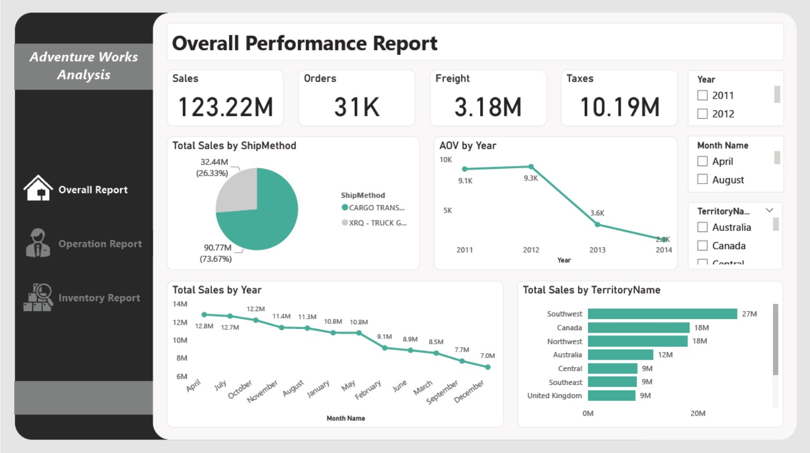
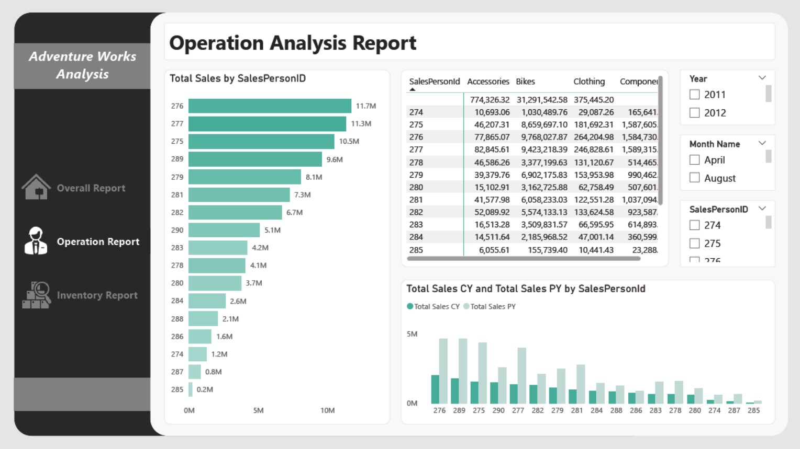
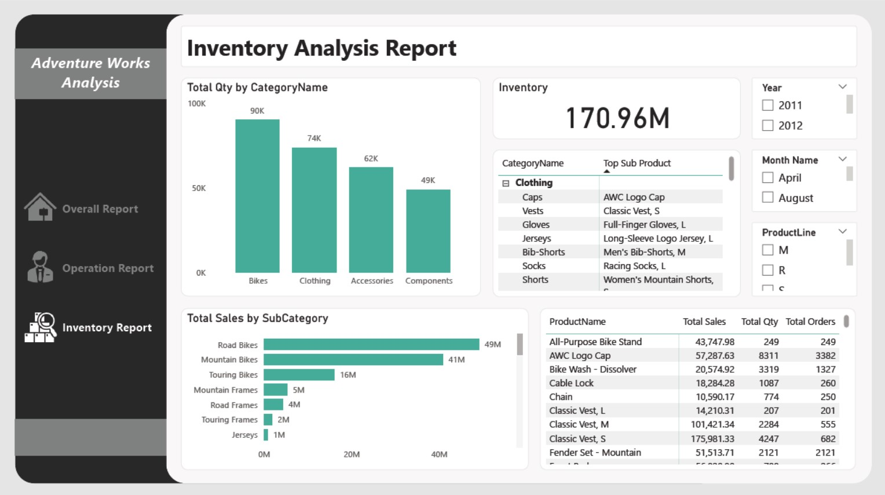

# Adventure Works Sales Dashboard 🚀

This repository contains an interactive Power BI dashboard developed using the **AdventureWorks2019 Database**. The dashboard provides comprehensive insights into sales performance, operational efficiency, and inventory management, enabling businesses to make informed decisions.

## Dashboards Overview

The dashboard is divided into **three main dashboards**:

### 1. Overall Performance Dashboard
- **KPIs**: Total Sales, Number of Orders, Total Freight, and Taxes.
- Visualizes total sales by year with drill-down capabilities to quarters and months.
- Displays the average order value (AOV) per year.
- Shows total sales for each territory and shipping method.



### 2. Operation Analysis Dashboard
- **KPIs**: Total sales by SalesPersonID.
- Visualizes total sales for each salesperson across categories.
- Compares total sales this year (CY) vs. the previous year (PY) for each salesperson to evaluate their performance effectively.



### 3. Inventory Report Dashboard
- **KPIs**: Total Inventory Value.
- Visualizes total sales by subcategory, quantity sold for each category, and analyzes sales, quantity, and orders for each product.
- Highlights the top-selling products in each category and subcategory to manage inventory efficiently.



## Dashboard Features
The dashboard features several interactive tools to enhance data analysis and user experience:
- **Drill-Through Functionality**: Click on categories to access detailed insights on total sales, orders, and inventory.
- **Drill-Down Capabilities**: Navigate from high-level summaries to detailed views, such as monthly and quarterly sales.
- **Synced Slicers**: Year and month slicers maintain consistent filtering across all dashboards.
- **Dynamic Filters**: Users can refine data using filters for Territory Name, Sales Person, and Product Line.

## Tools & Technologies
- **Visualization Tool**: Power BI

## Resources
- [AdventureWorks2019 Database on Microsoft](https://learn.microsoft.com/en-us/sql/samples/adventureworks-install-configure?view=sql-server-ver16&tabs=ssms)

## Repository Structure
```bash
adventure-works-dashboard/
│
├── images/
│   ├── overall_dashboard.jpg     
│   ├── operation_dashboard.jpg
│   └── inventory_dashboard.jpg
│
├── adventure_works_dashboard.pbix
└── README.md
